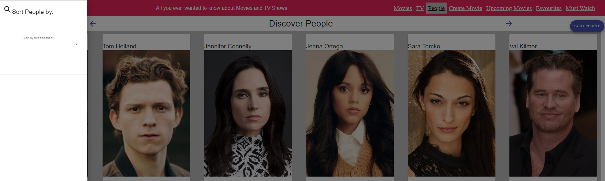
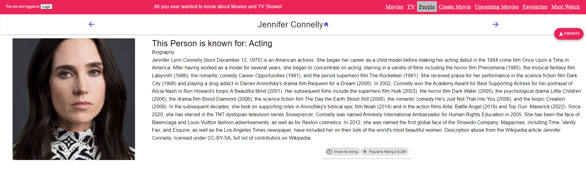

# ICT Skills 2 Assignment

Name: Sheila Kirwan

## Overview.

This app allows users to view information on movies, tv shows and people from the movie world, Users can also see a list of upcoming movies, tag a favourite movie and view that movie on the favourites page. Movies, TV, people all have related details pages. 

e.g.

+ Feature 1 - I have added a page that displays a list of current tv shows, for each one, I have shown a poster image, title, origin country and vote average as well as a hyperlink to "about the show" page. This page can be filtered by tv genre or searched by name.

+ Feature 2 - I have also created a detailed information tv show page which can be accessed from the hyperlink on the page above. The header includes tvshow name, homepage icon hyperlink, images of the tv show, list of genres relating to the show, release date, origin country, tv vote average. This page contains a floating action button (fab) displaying extracts of tv show reviews. 

+ Feature 3 - user can click on review to see full review page

+ Feature 4 - I have added a page that displays a list of actors/people, for each person, I have shown a poster image, title, id and popularity as well as a hyperlink to "info about this person" page. I also attempted sorting by person, the UI is complete but code was not successful.

+ Feature 5 - I have also created a detailed information for a person which can be accessed from the hyperlink on the page above. The header includes person name, homepage icon hyperlink, what part of the media business they are known for, a biography and popularity rating. 

+ Feature 6 - This person details page also contains a floating action button (fab) called credits which when clicked displays a dropdown drawer with a table containing title, character and "link to see more details on the credit" for all credits relating to the person.

+ Feature 7 - A user can click on a hyperlink relating to a particular credit to view the full credit details including title, release date overview and type of media for credit and also an image relating to that credit and an image of the person the credit relates to.

+ Feature 8 - A user can click on create movie in the navigation menu and a create fantasy movie form page is displayed. This allows the user to input fantasy movie title, select a genre and enter an overview of the fantasy movie. The user can submit or reset the page. validation is included and a snackbar message once submitted. The user is then returned to the homepage.

+ feature 9 - I have added an addition to the movie details page. It is a "Similar movies" table which contains the movie name, a description and a " click here to see video hyperlink" which brings the user to a page where they can view a short video of the similar movie they are interested in. They can also see movie id and name on this page.

+ Feature 10 - The app has basic authentication. I created a simple log in page which will be displayed when a user either attempts to click into a protected page (upcoming movies or favourites) or if the user logs in on the header bar on the far left side of the page.

+ Feature 11 - The app has a must have page. The intention is that a user can select an upcoming movie by clicking the add to playlist icon button and this movie will then be displayed on the must watch page. I attempted this code many time by using the same stucture addtofavourites but didn't get there in the end. The must have page will display but not anything that is added.

## Setup requirements.

[ Briefly state (to a third party) the setup steps necessary to run your app/client locally, e.g. .env and any other config files.]

+ Open a terminal and run npm install
+ Register with TMDB API, set up an account to create an API Key which will authenticate all requests to the API.
+ In Vscode, at the project base folder, create a .env file and set REACTAPPTMDB_KEY to your new key value.

REACT_APP_TMDB_KEY=.... your API key value ...
FAST_REFRESH=false

+ In the terminal install and ensure you can run the storybook server. npm run storybook to run.

## App Design.

### Routing/Navigation.

[List the set of routes your app supports - only mention new instances if you expanded the Movies Fan app. State the view linked with each route.] 

e.g.
+ /login - route to login page
+ /reviews/form - route to form to add reviews
+ /reviews/:id - route to specific movie review
+ "/" - homepage which is essentially moviepage
+ /movies/:id - route to a specified movie based on id
+ /movies/upComing - route to an upcoming movie page that displays all upcoming movies
+ /movies/favourites - route to favourites page which displays all favourites
+ /movieVideo/:id - route to a specified movie video based on id
+ /fantasymovie/form - route to form to add your fantasy movie
+ /movies/mustwatch - route to Must watch page which displays all seleced must watch movies
+ /persons - route to person page which displays all actors
+ /persons/:id - route to a specified person/actor based on id
+ /credits/:id - route to a credit relating to a specific actor based on id
+ "/tv - route to tv show page which displays all tv show
+ /tvShows/:id - route to a specified tv show based on id
+ /tvreviews/:id - route to specific tv review

### Views/Pages.

[ For each view in your app, show a screenshot and caption - only new/modified ones in the case of the Movies Fan app. If necessary, use multiple screenshots to cover a view's full capability.

All navigation arrows are working thoughout.

>Lists movies from the Discover endpoint. Filtering on title and genre attributes is supported. Movies can also be tagged as favourites and have release date and vote average detailed

>Shows detailed information on a specific movie as well as a list of similar movies. Hyperlink to homepage of movie on header. Each Similar movie item has a hyperlink to a video page to see a video of the similar movie. 

>when a user clicks on the reviews FAB, a materials  ui drawer is expanded describing, Author, except and full Review hyperlink

>from the movie details page, the user can select to see a video of the similar movie selected.

>Lists People from the discoverperson endpoint. attempted sort by name. person details such as id and popularity rating are displayed on the person cards as well as a hyperlink to "more info on this person"

>UI complete for sort by people but coding not complete

>Shows detailed information on a specific person as well as a list of similar movies. Hyperlink to homepage of person on header. Has a FAB which leads to a drawer of credit information specific to that person

>clicking on the credits FAB expands a drawer containing person info on title, Character and a hyperlink to see a a page dedicated to the details of that credit.

>clicking on the hyperlink on a particular credit displays a page dedicated to info and an image of that movie as well as the person who was in it.

>Lists Tv Shows from the discovertv endpoint. Filtering on title and genre attributes is supported. Tv show cards display origin country and vote average

>Shows detailed information on a specific tv show. The header includeds show name original language and a Hyperlink to homepage of show on header. Has a FAB which leads to a drawer of reviews specific to that tv show.

>Shows the create Fantasy movie form page, this page allows the user to enter a fantasy movie name, Genre and overview of the story and submit it. A snackbar message is displayed. Validation is also included

>Upcoming movies in a protected page and hence a login is required. 

>User is now authenticated as you will see by the welcome message in the next screenshot of upcoming movies page

>The upcoming movies page shows a list of upcoming movies, It also has a hyperlink to more info on the movie and an Icon so that the upcoming movie can be tagged as a must watch. (This tagging is not working correctly). each movie shows release date and vote average. There is also filtering by genre and a search field by title.

>Shows detailed information on a specific upcoming as well as a list of similar movies. Hyperlink to homepage of movie on header as well as title. Each Similar movie item has a hyperlink to a video page to see a video of the similar movie. (movie ui complete but not playing)

>The Favourites page displays any movies which were tagged as favourites on the movies page. The movies card has two additional icons. One to remove movie from favourites and the other to write a review of the movie

>The Must Watch page should show any movies selected by clicking the add to playlist icon in the upcoming movies list however I tried to code it similarly to favourites page but couldnt get it working. This is the ui

### Component catalogue.

list of components:
cardIcons - new icons included
fakeAuth - new
fantasyMovieForm - new
filterMoviesCard
filterPersonsCard - new
filterTvShowsCard -new
headerMovie
headerMovieList
headerPerson - new
headerPersonList - new
headerTv - new
headerTvList - new 
movieCard
movieDetails
movieList
movieReview
movieReviews
movieVideo - new
personCard - new
personCredit - new
personCredits -new
personDetails - new
personList -new
protectedRoute - new
reviewForm
similarMovies - new
siteHeader
spinner
templateMovieListPage
templateMoviePage
templatePersonListPage - new
templatePersonPage - new
templateTvListPage - new
templateTvPage - new
templateVideoPage - new
tvCard -new
tvDetails - new
tvList - new
tvReview - new
tvReviews - new

>I have completed 17 stories in total, 6 of these related to movie and the remainder to the tv and person pages. Below I'm showing the additional stories that I added or updated. 

>filterPersonsCard

>PersonsCard

>PersonHeader - error message due to issue

>filterTvShowCard

>TvCardstory - note that in my sampletvdata.js, the movie Marvels Daredevil had no associated jpg so I updated the sampletvdata.js with a jpeg from cobra Kai which worked fine.

>MovieDetails - I updated this story because I updated the page with a similar movies table.

>PersonDetails 

>TvDetails 

>TvHeader

>AppHeader - didn't run successfully due to the following error

## Caching.

[ List the TMDB server state cached by the app. Include a screenshot(s) of the react-query dev tools to validate your list.]

+ movies (discover) 
+ Movie details (movie) 
+ tv (discovertv) 
+ tv details (tv) 
+ person (discover person) 
+ person detail (person) 
+ upcoming movies (upcoming) 
+ add movie review page (movie review) 
+ template video page (videos) attempted not working
+ template tv page (tv images) 
+ template movie page (movie images) 
+ template person page (person images) 
+ filter tv shows card (tv genres) 
+ filter movies card (movie genres) 

>react tool screenshots of caching for following steps relating to movies
1. I refreshed the homepage (discover)
2. I clicked on filter (movie genres)
3. I selected a view movie details page (movie & movie images)
see below:

>react tool screenshots of caching for following steps relating to tv
1. I refreshed the tv page (discovertv)
2. I clicked on filter (tv genres)
3. I selected a view movie details page (tv)
4. I selected a tv review (tv images)
see below:

>react tool screenshots of caching for following steps relating to People
1. I refreshed the person page (discover person)
2. I selected a view movie details page (person & person images)
see below:

>react tool screenshots of caching for following steps relating to upcoming movies
1. I refreshed the upcoming page (upcoming)
2. I clicked on filter (movie genres)
3. I selected a view movie details page (movie & movie images)
see below:

>react tool screenshots of caching for following steps relating to adding a review
1. I refreshed the homepage (discover)
2. I tagged a favourite
3. I clicked on favourites page
4. I clicked on add review icon (movie review and movie images)
3. 
see below:

## Authentication (if relevant).

[Briefly state how you implemented authentication for the app, e.g. basic, Firebase, etc. Also, list the routes that are private/protected.]

I implemented a basic Authentication model on my app as discribed in sample 8 in the labs however I updated the UI and ensured it fit in well with the look and feel of the website. I used a react context file to store current authenticated user. I used programmatic navigation to redirect unauthenticated users to the login page and remembered the users intent before forced authentications so they don't have to navigate back to the page they were going to in the first place.

+ /movies/favourites
+ /movies/mustwatch

## Server-side persistence (if relevant)

 Unfortunatly, I did not have enough time to attempt this.

## Additional features (if relevant),

[Mention any additional user features of your app that may not be obvious from the previous sections, e.g. pagination, extended filtering/sorting, searching.]

All features have been mentioned above

## Independent learning (if relevant),

[Briefly explain any aspects of your assignment work that required independent learning (i.e. not addressed in the lectures or labs) on your behalf., e.g. 3rd-party components, libraries, tools. Include source code references.]

+ Use of a mediacard to display a video

[video]: https://smartdevpreneur.com/four-examples-of-material-ui-cardmedia/#Resources

All other aspects of my project were covered in the talks, labs or in the links to material ui provided in this module.