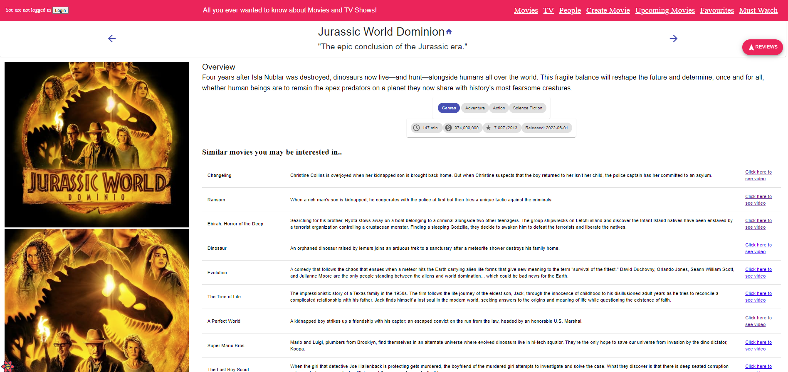

# ICT Skills 2 Assignment

Name: [Sheila Kirwan]

## Overview.

[ A paragraph on your React app's concept followed by a bullet-point list of its feature set - only list new/modified features if you are expanding the Movies app. ]

e.g. 
+ Feature 1
+ Feature 2
+ Feature 3
+ etc
+ etc

## Setup requirements.

[ Briefly state (to a third party) the setup steps necessary to run your app/client locally, e.g. .env and any other config files.]

## App Design.

### Routing/Navigation.

[List the set of routes your app supports - only mention new instances if you expanded the Movies Fan app. State the view linked with each route.] 

e.g.
+ /login - route to login page
+ /reviews/form - route to form to add reviews
+ /reviews/:id - route to specific movie review
+ "/" - homepage which is essentially moviepage
+ /movies/:id - route to a specified movie based on id
+ /movies/upComing - route to an upcoming movie page that displays all upcoming movies
+ /movies/favourites - route to favourites page which displays all favourites
+ /movieVideo/:id - route to a specified movie video based on id
+ /fantasymovie/form - route to form to add your fantasy movie
+ /movies/mustwatch - route to Must watch page which displays all seleced must watch movies
+ /persons - route to person page which displays all actors
+ /persons/:id - route to a specified person/actor based on id
+ /credits/:id - route to a credit relating to a specific actor based on id
+ "/tv - route to tv show page which displays all tv show
+ /tvShows/:id - route to a specified tv show based on id
+ /tvreviews/:id - route to specific tv review

### Views/Pages.

[ For each view in your app, show a screenshot and caption - only new/modified ones in the case of the Movies Fan app. If necessary, use multiple screenshots to cover a view's full capability.

All navigation arrows working thoughout.

>Lists movies from the Discover endpoint. Filtering on title and genre attributes is supported. Movies can also be tagged as favourites and have release date and popularity detailed

>Shows detailed information on a specific movie as well as a list of similar movies. Hyperlink to homepage of movie on header. Each Similar movie item has a hyperlink to a video page to see a video of the similar movie. 

>when a user clicks on the reviews FAB, a materials  ui drawer is expanded describing, Author, except and full Review hyperlink

>from the movie details page, the user can select to see a video of the similar movie selected.

>Lists People from the discoverperson endpoint. attempted sort by name. person details such as id and popularity rating are displayed on the person cards as well as a hyperlink to "more info on this person"

>UI complete for sort by people but coding not complete

>Shows detailed information on a specific person as well as a list of similar movies. Hyperlink to homepage of person on header. Has a FAB which leads to a drawer of credit information specific to that person

>clicking on the credits FAB expands a drawer containing person info on title, Character and a hyperlink to see a a page dedicated to the details of that credit.

>clicking on the hyperlink on a particular credit displays a page dedicated to info and an image of that movie as well as the person who was in it.

### Component catalogue.

[ Use the Storybook UI to highlight the new components for which you developed stories.]
e.g.

![][stories]

## Caching.

[ List the TMDB server state cached by the app. Include a screenshot(s) of the react-query dev tools to validate your list.]

e.g.
+ Discover movies (pagination support)
+ Movie details
 + etc
+ etc

![][caching]

## Authentication (if relevant).

[Briefly state how you implemented authentication for the app, e.g. basic, Firebase, etc. Also, list the routes that are private/protected.]

e.g.
+ /reviews/:id
+ /movies/favourites

## Server-side persistence (if relevant)

[ Specify the persistence 
platform your app uses (e.g. TMDB lists, Firestore) and itemize the data it persists.]

## Additional features (if relevant),

[Mention any additional user features of your app that may not be obvious from the previous sections, e.g. pagination, extended filtering/sorting, searching.]

## Independent learning (if relevant),

[Briefly explain any aspects of your assignment work that required independent learning (i.e. not addressed in the lectures or labs) on your behalf., e.g. 3rd-party components, libraries, tools. Include source code references.]

[d1]: ./public/discover1.png
[d2]: ./public/discover2.png
[detail]: ./public/detail.png
[caching]: ./public/caching.png
[stories]: ./public/stories.png